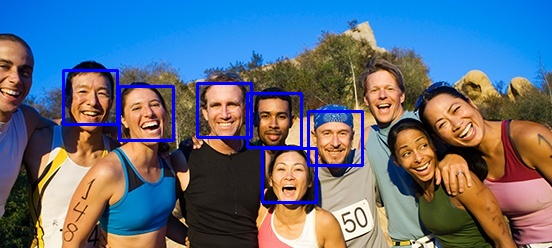
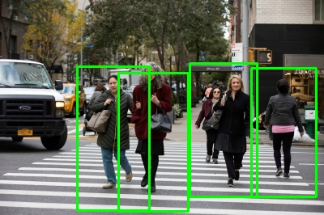

### Intro

Sample project that uses flask and opencv to pass an image from client.py to server.py and perform
face and pedestrian detection. The api returns the max of faces detected or pedestrians detected.

### Instructions

#### Setup

Use with python 3.6

```pipenv --python 3.6```

```pipenv install -r requirements.txt```

```pipenv shell```

#### Running

```python server.py```

```python client.py```

In client, change the filename to use different images.

#### Notes

The master branch uses opencv with haar features for face detection. It uses less dependencies but is less accurate.

The branch f/cnn_face_detection uses CNNs and has better accuracy but requires more dependencies, including tensorflow.





### Resources

People counter https://www.pyimagesearch.com/2018/08/13/opencv-people-counter/